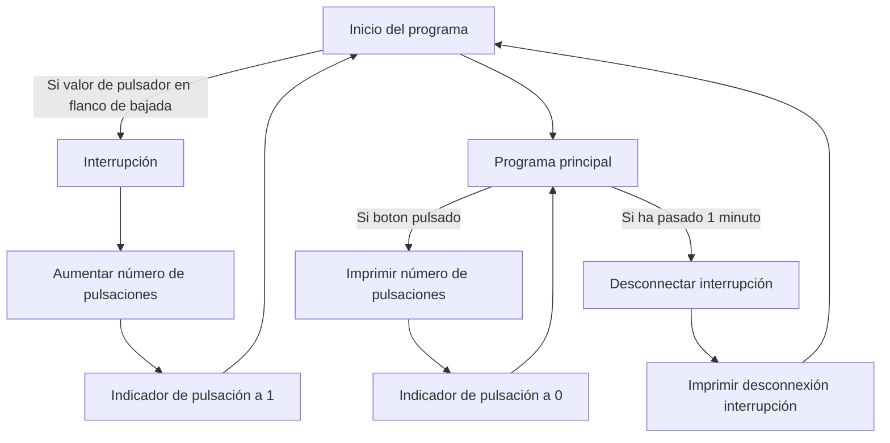
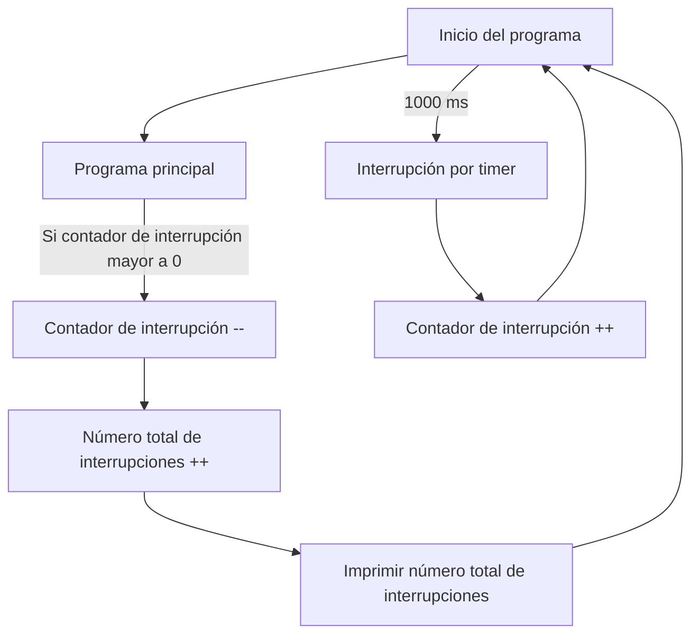
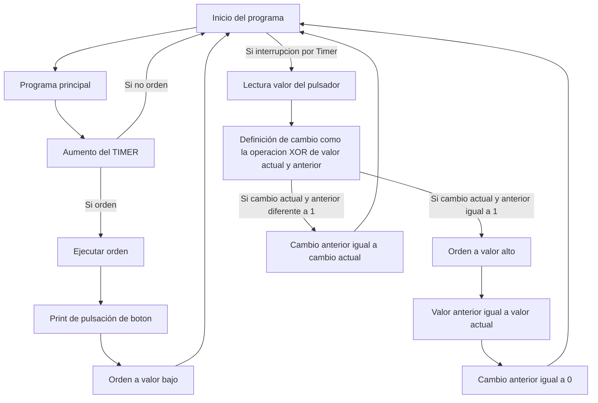

# Práctica 2. Gerard Cots y Joel J. Morera

## Interrupción por GPIO

Con el fin de llevar a cabo una interrupción por hardware, en el siguiente código se define un botón, que se implementa en una protoboard en hardware y en la estructura `Button` en software. 

Este genera una interrupción cada vez que se pulsa, es decir cuando se encuentra en flanco de bajada. La interrupción augmenta el número de pulsaciones totales y indica que se ha pulsado el botón mediante la variable `pressed`.

Si se ha pulsado el botón se imprime por pantalla el numero de pulsaciones. Al cabo de un minuto se desconecta la interrupción, llamando a la función `detachInterrup(GPIOPin)`.

El **código** es el siguiente:

```cpp
#include <Arduino.h>

// Definicion estructura boton
struct Button 
{
    const uint8_t PIN;                          //Pin del boton
    uint32_t numberKeyPresses;                  //Numero de pulsaciones
    bool pressed;                               //Variable de pulsado
};

// Declaracion de 'boton1' en el pin 18
Button button1 = {18, 0, false};

// Declaracion de la funcion 'Servicio de interrupcion de rutina'
void IRAM_ATTR isr()
{
    button1.numberKeyPresses += 1;              //Aumentamos el numero total de interrupciones
    button1.pressed = true;                     //Ponemos la variable de pulsado a valor alto
}

//Declaracion de variables
static uint32_t lastMillis = 0;

//Codigo que solo se ejecuta una vez
void setup() 
{
    Serial.begin(115200);                       //Velocidad de transmision
    pinMode(button1.PIN, INPUT_PULLUP);         //Definimos el pin del boton como Input Pullup
    attachInterrupt(button1.PIN, isr, FALLING); //Adjuntamos la interrupcion al boton por flanco de bajada
}

//Codigo que se ejecuta en bucle
void loop() {
    //En caso de pulsar el boton
    if (button1.pressed) 
    {
        Serial.printf("Button 1 has been pressed %u times\n", button1.numberKeyPresses);        //Imprimimos por pantalla el numero de pulsaciones
        button1.pressed = false;                //Ponemos la variable de pulsado a valor bajo
    }

    //Desconectar interrupción despues de 1 minuto
    if (millis() - lastMillis > 60000) 
    {
        lastMillis = millis();                  //Guardamos el valor de millisegundos en una variable
        detachInterrupt(button1.PIN);           //Desconnectamos la interrupcion
        Serial.println("Interrupt Detached!");  //Imprimimos por pantalla el la desconnexión
    }
} 
```

Las **salidas** que se han obtendido del programa son:

```bash
Button 1 has been pressed 1 times
Button 1 has been pressed 2 times
Button 1 has been pressed 3 times
Button 1 has been pressed 4 times
Button 1 has been pressed 5 times
...
Button 1 has been pressed 2606 times
Interrupt Detached!
```

( Debido a que en el laboratorio no disponiamos de pulsadores, hemos simulado el puslador usando un cortocircuito, con lo cual aparecen rebotes, disparando el número de veces que se presiona el pulsador. )

El **diagrama de flujo** del programa es:



## Interrupción por Timer

En la siguiente parte de la practica, se describe una interrupción por 'timer'. Para ello, se definen primero todas la variables necesarias.

Seguidamente, definimos la periocidad del 'timer', que se ejecutará una vez por segundo. Por cada interrupción se augmenta el contador de interrupción, que aparece en el código como `interruptCounter`. 

Siempre que se edite la variable `interruptCounter`, para evitar que esta acción entre en conflicto, se realiza dentro de una sección crítica ya que la variable se comparte con el programa principal.

Dentro del programa principal, siempre que `interruptCounter` sea mayor a 0 se decrementará la variable y se imprimirá por pantalla el numero total de interrupciones.

El **código** es el siguiente:

```cpp
#include <Arduino.h>

//Declaracion de variables para el timer
volatile int interruptCounter;
int totalInterruptCounter;
hw_timer_t * timer = NULL;
portMUX_TYPE timerMux = portMUX_INITIALIZER_UNLOCKED;

//Funcion ISR
void IRAM_ATTR onTimer()
{
    portENTER_CRITICAL_ISR(&timerMux);                // Aumentamos el interruptor del contador dentro de una seccion critica
    interruptCounter++;                               //ya que la variable se comparte con el programa principal
    portEXIT_CRITICAL_ISR(&timerMux);
}

//Codigo que solo se ejecuta al inicio
void setup() 
{
    Serial.begin(115200);                             //Velocidad de transmision
    timer = timerBegin(0, 80, true);                  //Iniciamos el timer
    timerAttachInterrupt(timer, &onTimer, true);      //Relacionamos el timer a la funcion
    timerAlarmWrite(timer, 1000000, true);            //Especificar el valor del contador en el que se genera la interrupcion
    timerAlarmEnable(timer);                          //Habilitamos el temporizador
}

//Codigo que se repite en bucle
void loop() 
{
     if (interruptCounter > 0)                         //Si el contador de interrupciones es mayor a 0
    {
        portENTER_CRITICAL(&timerMux);                //Como la variable se comparte con la funcion 
        interruptCounter--;                           //ISR decrementamos el contador dentro de una seccion critica
        portEXIT_CRITICAL(&timerMux);
        totalInterruptCounter++;                      //Aumentamos el numero total de interrupciones
        
        Serial.print("An interrupt has occurred. Total number: ");
        Serial.println(totalInterruptCounter);        //Imprimimos por pantalla el numero total de interrupciones
    }
}
```

Las **salidas** que se han obtendido del programa son:

```bash
An interrupt has occurred. Total number: 1
An interrupt has occurred. Total number: 2
An interrupt has occurred. Total number: 3
An interrupt has occurred. Total number: 4
An interrupt has occurred. Total number: 5
An interrupt has occurred. Total number: 6
An interrupt has occurred. Total number: 7
An interrupt has occurred. Total number: 8
An interrupt has occurred. Total number: 9
...
```
El **diagrama de flujo** del programa es el siguiente:



## EXTRA: Filtrado pulsador

Como ejercicio complementario, en este código se describe una interrupción por timer que se encarga de filtrar la activación de un pulsador.

Concretamente, durante intervalos de 10 milisegundos se revisa la situación del pulsador, en caso de dos cambios de estado consecutivos a voltaje alto, se activa una orden, que posteriormente, en el bucle principal, activiará un pequeña parte del codigo.

Cada cambio se define como la operación XOR del valor actual y del anterior, en caso que se detecte un cambio de estado, el cambio será cierto.

El cambio de estado actual se guarda en la variable `cama` que almacena el valor anterior de cambio de estado. Si en la siguiente iteración se detecta otro cambio de estado, se actualiza la orden a valor alto.

El **código** del programa es:

```cpp
#include <Arduino.h>

//Declaracion de variables para el timer
volatile int interruptCounter;
int totalInterruptCounter;
hw_timer_t * timer = NULL;
portMUX_TYPE timerMux = portMUX_INITIALIZER_UNLOCKED;

//Declaracion variables para el filtro
bool valor_act,valor_ant = 0,cambio_anterior = 0,cambio_actual,orden = 0;


//Codigo de la interrupcion TIMER
void IRAM_ATTR onTimer()
{
    portENTER_CRITICAL_ISR(&timerMux);                // Aumentamos el interruptor del contador dentro de una seccion critica
    interruptCounter++;                               //ya que la variable se comparte con el programa principal
    portEXIT_CRITICAL_ISR(&timerMux);
    
    //Filtro
    valor_act = digitalRead(4);                       //Leemos valor del pin donde esta  connectado el pulsador

    cambio_actual = valor_ant ^ valor_act;            //Funcion XOR de valor anterior y actual

    if (cambio_actual == 1 && cambio_anterior == 1)   //Si ambos cambios estan a nivel alto:
    {
      orden = 1;                                      //Ponemos "orden" en valor alto
      digitalWrite(18,valor_act);                     //Escribimos el valor por el pin 18 para ver cuando se efectua
                                                      // la pulsacion
      valor_ant = valor_act;                          //Guardamos el nuevo valor en el valor anterior                                  
      cambio_anterior = 0;                            //Ponemos el cambio anterior a 0
      return;                                         //Salimos del timer
    }
    cambio_anterior = cambio_actual;                  //En caso contrario guardamos el cambio en la variable cambio anterior
}

//Codigo que solo se ejecuta al inicio
void setup() 
{
    Serial.begin(115200);                             //Velocidad de transmision
    timer = timerBegin(0, 80, true);                  //Iniciamos el timer
    timerAttachInterrupt(timer, &onTimer, true);      //Relacionamos el timer a la funcion
    timerAlarmWrite(timer, 10000, true);              //Especificar el valor del contador en el que se genera la interrupcion
    timerAlarmEnable(timer);                          //Habilitamos el temporizador
    pinMode(18,OUTPUT);                               //Definimos el pin 18 como salida
    pinMode(4,INPUT_PULLUP);                          //Definimos el pin 4 como entrada "pull up"(Necesaria en pulsador)
}

//Codigo que se ejecuta en bucle
void loop() 
{
    if (interruptCounter > 0)                         //Si el contador de interrupciones es mayor a 0
    {
        portENTER_CRITICAL(&timerMux);                //Como la variable se comparte con la funcion 
        interruptCounter--;                           //ISR decrementamos el contador dentro de una seccion critica
        portEXIT_CRITICAL(&timerMux);
        totalInterruptCounter++;                      //Aumentamos el numero total de interrupciones
        //En caso de orden a valor alto
        if (orden)                                    //Codigo que se ejecuta si se recibe la orden
        {
          Serial.println("Se ha pulsado en boton!");  //Escribimos mensaje de confirmacion
          orden = 0;                                  //Una vez ejecutado, reiniciamos la variable
        }
    }
}
```

Como resultado, podemos ver que ante los rebotes el programa lee las múltiples pulsaciones como una única pulsación:


El **diagrama de flujo** del programa es:

